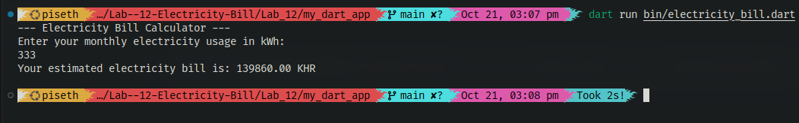

# កម្មវិធីគណនាវិក្កយបត្រអគ្គិសនី Dart

កម្មវិធី Dart នេះ គណនាវិក្កយបត្រអគ្គិសនីប្រចាំខែរបស់អ្នក ដោយផ្អែកលើរចនាសម្ព័ន្ធតម្លៃតាមកម្រិត (tiered pricing structure)។

## លក្ខណៈពិសេស (Features)

*   គណនាវិក្កយបត្រអគ្គិសនី ដោយផ្អែកលើការប្រើប្រាស់ក្នុង unit kilowatt-hours (kWh)។
*   គាំទ្រទាំងការបញ្ចូលដោយផ្ទាល់ (interactive input) និង arguments បញ្ជាបន្ទាត់ពាក្យបញ្ជា (command-line arguments) សម្រាប់ការប្រើប្រាស់។
*   អនុវត្តប្រព័ន្ធកំណត់តម្លៃតាមកម្រិត (tiered pricing system) ជាមួយនឹងអត្រាផ្សេងៗគ្នាសម្រាប់កម្រិតនៃការប្រើប្រាស់ផ្សេងៗគ្នា។

## រចនាសម្ព័ន្ធតម្លៃ (Pricing Structure)

អត្រាតម្លៃខាងក្រោមនេះត្រូវបានអនុវត្ត:

| ការប្រើប្រាស់ (kWh/month) | អត្រា (KHR/kWh) |
| :---------------- | :------------- |
| 0-100             | 150            |
| 101-200           | 210            |
| 201-300           | 300            |
| 301-400           | 420            |
| 401-500           | 520            |
| Above 500         | 670            |

## របៀបដំណើរការ (How to Run)

### ១. ការដំណើរការដោយផ្ទាល់ (Interactive Mode)

ដើម្បីដំណើរការកម្មវិធីគណនា និងបញ្ចូលការប្រើប្រាស់ដោយផ្ទាល់:

1.  ចូលទៅកាន់ directory គម្រោងក្នុង terminal របស់អ្នក:
    ```bash
    cd ../Lab_12/my_dart_app
    ```
2.  ដំណើរការ Dart script:
    ```bash
    dart run bin/electricity_bill.dart
    ```
3.  កម្មវិធីនឹងសួរអ្នកឱ្យបញ្ចូលការប្រើប្រាស់អគ្គិសនីប្រចាំខែរបស់អ្នកជា kWh។

### ២. ការដំណើរការតាម Command-Line Argument Mode

អ្នកក៏អាចផ្តល់ការប្រើប្រាស់អគ្គិសនីប្រចាំខែដោយផ្ទាល់ជា command-line argument បានផងដែរ:

1.  ចូលទៅកាន់ directory គម្រោងក្នុង terminal របស់អ្នក:
    ```bash
    cd ../Lab_12/my_dart_app
    ```
2.  ដំណើរការ Dart script ជាមួយនឹង kWh value ជា argument:
    ```bash
    dart run bin/electricity_bill.dart <your_kwh_usage>
    ```
    ជំនួស `<your_kwh_usage>` ជាមួយនឹងចំនួន kWh ពិតប្រាកដ (ឧទាហរណ៍ `350`)។

## ឧទាហរណ៍នៃការប្រើប្រាស់ (Example Usage)

**Interactive:**
```bash
dart run bin/electricity_bill.dart
--- Electricity Bill Calculator ---
Enter your monthly electricity usage in kWh:
350
Your estimated electricity bill is: 147000.00 KHR
```

**Command-Line Argument:**
```bash
dart run bin/electricity_bill.dart 350
--- Electricity Bill Calculator ---
Your estimated electricity bill is: 147000.00 KHR
